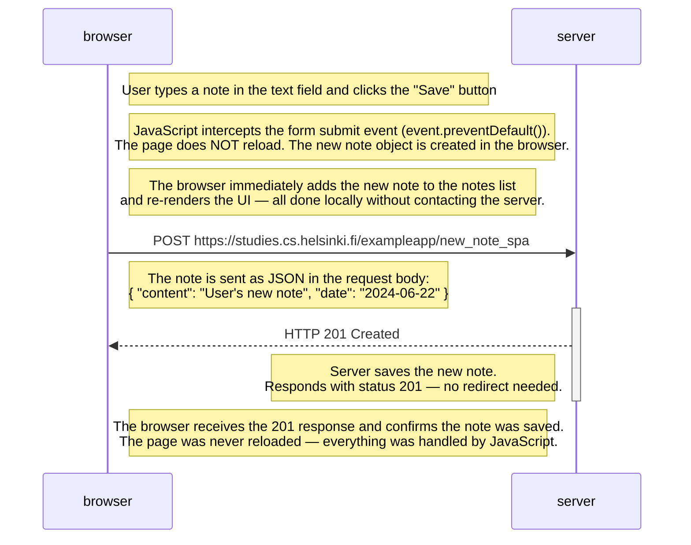

# Exercise 0.6: New Note in Single Page App Diagram

Sequence diagram showing what happens when the user creates a new note using the single-page version of the notes app at
https://studies.cs.helsinki.fi/exampleapp/spa

